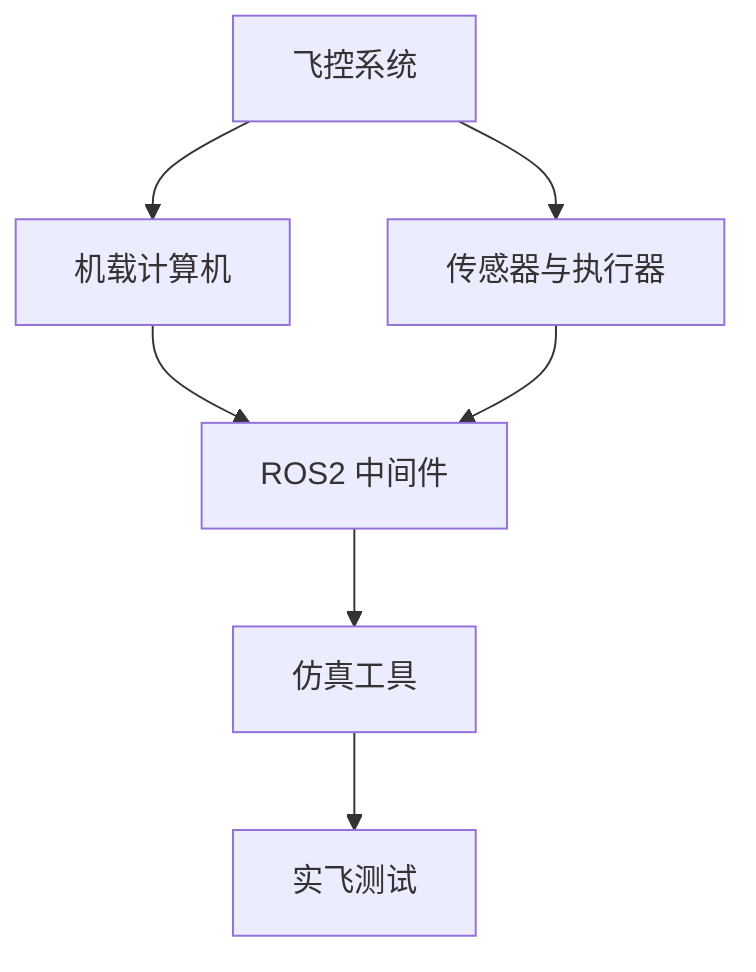

# 无人机开发专题

从飞控到底层、从仿真到实飞，系统梳理无人机开发全链路。

## 路线概览

## 文档目录

### 飞控系统

- **PX4 飞控** — 开源飞控架构、uORB 消息总线、飞行模式与状态机
- **ArduPilot** — 与 PX4 的对比、适用场景、固定翼/旋翼/垂起支持
- **飞控硬件选型** — Pixhawk 系列、Cube Orange、Holybro 等主流硬件对比
- **固件编译与烧录** — PX4-Autopilot 源码编译、自定义固件、QGC 参数调试

### 机载计算机与底层

- **NVIDIA Jetson 系列** — Orin NX / AGX Xavier 性能对比、JetPack SDK、CUDA 加速
- **树莓派** — 与飞控的串口通信、低成本机载方案
- **MAVLink 协议** — 消息格式、MAVSDK 集成、自定义消息
- **QGroundControl** — 地面站配置、航点规划、日志分析
- **RTK 与高精度定位** — RTK GPS 原理、基站-流动站搭建、厘米级定位

### ROS2

- **ROS2 基础** — 节点、话题、服务、Action、DDS 通信
- **PX4-ROS2 桥接** — px4_ros_com、MicroXRCEAgent、话题映射
- **无人机感知** — 视觉里程计（VIO）、激光 SLAM、目标检测与跟踪
- **路径规划** — 全局规划（A*/RRT）、局部避障、模型预测控制（MPC）
- **自主飞行实战** — offboard 模式、位置/速度/姿态控制指令

### 仿真工具

- **Gazebo** — SDF 模型编写、PX4 SITL 仿真、传感器仿真
- **AirSim** — 微软无人机仿真、Unreal Engine 渲染、PX4/ArduPilot 集成
- **jMAVSim** — PX4 官方轻量仿真、快速验证
- **Isaac Sim** — NVIDIA Omniverse 平台、高保真传感器仿真、域随机化
- **仿真算法验证** — HITL/SITL 区别、CI/CD 集成仿真测试

### 视觉与感知

- **OpenCV 机载应用** — 目标识别、视觉跟踪、特征匹配
- **VIO 视觉惯性里程计** — VINS-Mono、ORB-SLAM3、PX4 视觉定位
- **深度学习部署** — TensorRT 优化、ONNX 模型导出、边缘推理
- **3D 感知** — 深度相机（D435i/OAK-D）、激光雷达、点云处理

### 任务系统

- **自主导航** — GPS 航点、视觉导航、室内无 GPS 方案
- **集群与编队** — 多机通信架构、编队保持、分布式任务分配
- **避障系统** — 超声波、深度相机、激光雷达多传感器融合避障
- **远程图传** — 4G/5G 远程控制、RTSP 视频流、低延迟方案

### 开发工具链

- **开发环境搭建** — Ubuntu + ROS2 + PX4 + Gazebo 一键环境
- **调试与日志** — ulog 分析、rosbag 记录回放、plotjuggler 可视化
- **CI/CD 与测试** — 单元测试、飞行测试自动化、HIL 硬件在环
- **地面站二次开发** — QGC 自定义控件、MAVSDK-Python 自动化脚本

## 学习建议

1. **先搭仿真环境**，Gazebo + PX4 SITL + QGC 是最低成本的入门路径，炸机不用赔钱
2. **从 MAVLink 协议入手**，理解飞控和机载计算机之间的通信，这是全链路的枢纽
3. **ROS2 是必须跨过的坎**，不要死磕 ROS1——PX4 官方已全面转向 ROS2
4. **先在仿真中跑通完整流程**，再上实飞。实飞遵循：安全员 → 自稳 → 定高 → GPS → offboard 的渐进式验证
5. **日志是你的救命稻草**，每次飞行后第一时间导出 ulog，比事后问"为什么炸了"有效得多
