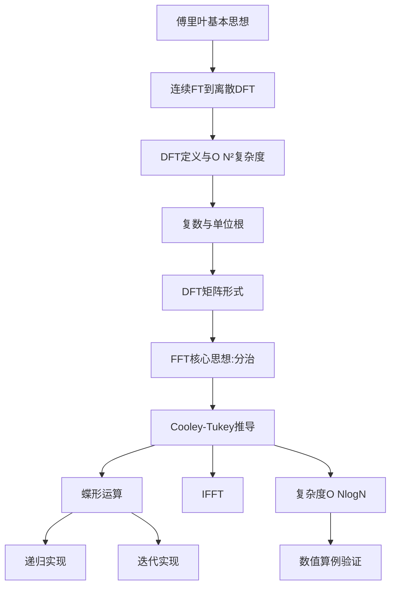

# 快速傅里叶变换（FFT）



---

# 第 1 章　傅里叶变换的基本思想

## 1.1 一个核心信念

傅里叶分析建立在一个深刻而优美的信念之上：

> **任意满足一定条件的信号，都可以表示成不同频率的正弦波，或复指数函数的叠加。**

打个比方：一段交响乐听起来很复杂，但它本质上是钢琴、小提琴、大提琴等许多**单一频率音符**的叠加。傅里叶变换做的事情，就是把这段“交响乐”拆解，告诉你**每个频率成分各占多少分量**。

## 1.2 连续傅里叶变换

设连续时间信号为：

$$
x(t)
$$

它的频谱记为：

$$
X(\omega)
$$

其中：

$$
X(\omega)
$$

表示角频率为：

$$
\omega
$$

的频率分量的**强度与相位**。

**正变换：时域到频域**

$$
X(\omega)=\int_{-\infty}^{\infty}x(t)e^{-j\omega t}\,dt
$$

**逆变换：频域到时域**

$$
x(t)=\frac{1}{2\pi}\int_{-\infty}^{\infty}X(\omega)e^{j\omega t}\,d\omega
$$

符号说明：

| 符号      | 含义                     |
| --------- | ------------------------ |
| `j`       | 虚数单位，满足 `j² = -1` |
| `ω`       | 角频率                   |
| `e^{jωt}` | 复指数基函数             |

## 1.3 为什么用复指数？

由**欧拉公式**：

$$
e^{j\theta}=\cos\theta+j\sin\theta
$$

可见复指数：

$$
e^{j\theta}
$$

同时打包了余弦，也就是实部，和正弦，也就是虚部。用一个复指数，就能同时描述**振幅**与**相位**，比单独写 sin、cos 简洁得多。这就是傅里叶分析钟爱复指数的原因。

> 📌 **本章小结**：傅里叶变换就是把信号分解为不同频率复指数的叠加；复指数因欧拉公式而能统一表示正弦与余弦。

---

# 第 2 章　从连续到离散：DFT 的登场

## 2.1 为什么需要离散版本？

计算机无法存储“连续”的信号，它只能处理**有限个采样点**。因此我们需要离散版本的傅里叶变换。

设有长度为 N 的离散序列：

$$
x[0],\,x[1],\,x[2],\,\dots,\,x[N-1]
$$

我们想知道：**这段序列里包含哪些频率成分？**

## 2.2 离散傅里叶变换（DFT）

**正变换：DFT**

$$
X[k]=\sum_{n=0}^{N-1}x[n]\,e^{-j\frac{2\pi}{N}kn}
$$

**逆变换：IDFT**

$$
x[n]=\frac{1}{N}\sum_{k=0}^{N-1}X[k]\,e^{j\frac{2\pi}{N}kn}
$$

符号说明：

| 符号   | 含义           |
| ------ | -------------- |
| `n`    | 时域采样点编号 |
| `k`    | 频域采样点编号 |
| `x[n]` | 时域信号       |
| `X[k]` | 频域结果       |
| `N`    | 序列长度       |

## 2.3 几何直觉

DFT 可以理解为一种**投影**：

> 把长度为 N 的序列，投影到 N 个不同频率的复指数基函数上，得到每个频率上的“投影长度”。

这与线性代数中“向量在一组正交基上的投影”是完全一致的思想。我们会在第 5 章看到它的矩阵形式。

---

# 第 3 章　DFT 的直接计算复杂度

## 3.1 数一数要做多少次运算

回顾定义：

$$
X[k]=\sum_{n=0}^{N-1}x[n]\,e^{-j\frac{2\pi}{N}kn}
$$

- 对**每一个** k，求和号里有 N 项，因此需要 N 次乘法和 N 次加法。
- k 取值为：

$$
0,1,\dots,N-1
$$

共 N 个值。

总运算量约为：

$$
N\times N=N^2
$$

因此，**直接计算 DFT 的复杂度为：**

$$
O(N^2)
$$

## 3.2 这个代价有多可怕？

|       N |  直接 DFT 运算量 |
| ------: | ---------------: |
|    1024 | 约 `1.05 × 10^6` |
| 1000000 |       约 `10^12` |

当 N 等于 1000000 时，`10^12` 级别的运算即便在现代 CPU 上也要耗费可观的时间。

## 3.3 FFT 的使命

> **FFT 的目标**：利用 DFT 内部隐藏的**对称性**与**周期性**，把复杂度从：

$$
O(N^2)
$$

降低到：

$$
O(N\log N)
$$

这正是接下来要展开的核心内容。

---

# 第 4 章　前置知识：复数与单位根

## 4.1 复数的两种形式

**代数形式：**

$$
z=a+jb
$$

其中 a 为实部，b 为虚部。

**极坐标形式：**

$$
z=re^{j\theta}
$$

其中 r 为模长，θ 为相位角。

两者通过欧拉公式连接：

$$
re^{j\theta}=r\cos\theta+jr\sin\theta
$$

## 4.2 旋转因子

DFT 中反复出现的核心复指数是：

$$
W_N=e^{-j\frac{2\pi}{N}}
$$

它称为 **N 次单位根**，也叫**旋转因子**，英文为 twiddle factor。

于是 DFT 可写成更紧凑的形式：

$$
X[k]=\sum_{n=0}^{N-1}x[n]\,W_N^{kn}
$$

其中：

$$
W_N^{kn}=e^{-j\frac{2\pi}{N}kn}
$$

> **几何直觉**：每个：
>
> $$
> W_N^m
> $$
>
> 都是单位圆上的一个点。每乘一次：
>
> $$
> W_N
> $$
>
> 就在单位圆上**顺时针旋转**：
>
> $$
> \frac{2\pi}{N}
> $$
>
> 弧度。FFT 的全部魔法，都藏在这个“旋转”的规律里。

## 4.3 性质一：周期性

由于绕单位圆一整圈回到原点：

$$
W_N^N=e^{-j2\pi}=1
$$

因此：

$$
W_N^{m+N}=W_N^m
$$

更一般地：

$$
W_N^{m+qN}=W_N^m,\qquad q\in\mathbb{Z}
$$

## 4.4 性质二：对称性

FFT 的灵魂是：

$$
W_N^{k+\frac{N}{2}}=-W_N^k
$$

**证明：**

$$
W_N^{k+\frac{N}{2}}=W_N^k\cdot W_N^{\frac{N}{2}}
$$

而：

$$
W_N^{\frac{N}{2}}=e^{-j\frac{2\pi}{N}\cdot\frac{N}{2}}=e^{-j\pi}=-1
$$

所以：

$$
W_N^{k+\frac{N}{2}}=-W_N^k
$$

证毕。

> 🔑 **记住这两条性质：周期性与对称性。**
>
> 它们是把一份计算“一拆为二”的关键，下文蝶形运算正源于此。

---

# 第 5 章　DFT 的矩阵视角

## 5.1 把 DFT 写成矩阵乘法

令输入向量与输出向量分别为：

$$
\mathbf{x}=
\begin{pmatrix}
x[0]\\
x[1]\\
\vdots\\
x[N-1]
\end{pmatrix}
$$

$$
\mathbf{X}=
\begin{pmatrix}
X[0]\\
X[1]\\
\vdots\\
X[N-1]
\end{pmatrix}
$$

则 DFT 等价于：

$$
\mathbf{X}=\mathbf{F}_N\mathbf{x}
$$

其中 DFT 矩阵为：

$$
\mathbf{F}_N=
\begin{pmatrix}
W_N^{0\cdot0} & W_N^{0\cdot1} & \cdots & W_N^{0\cdot(N-1)}\\
W_N^{1\cdot0} & W_N^{1\cdot1} & \cdots & W_N^{1\cdot(N-1)}\\
\vdots & \vdots & \ddots & \vdots\\
W_N^{(N-1)\cdot0} & W_N^{(N-1)\cdot1} & \cdots & W_N^{(N-1)\cdot(N-1)}
\end{pmatrix}
$$

## 5.2 从矩阵看复杂度与 FFT 本质

矩阵-向量乘法天然是：

$$
O(N^2)
$$

但：

$$
\mathbf{F}_N
$$

不是普通矩阵，它高度**结构化**，元素全是单位根的幂。

> **FFT 的矩阵本质**：
>
> 将稠密的 DFT 矩阵分解为若干个稀疏矩阵的乘积，从而把：
>
> $$
> O(N^2)
> $$
>
> 的稠密乘法变成：
>
> $$
> O(N\log N)
> $$
>
> 的稀疏乘法。

---

# 第 6 章　FFT 的核心思想：分而治之

## 6.1 澄清一个常见误解

> ⚠️ **FFT 不是一种新的变换！**

FFT 与 DFT 的计算结果完全相同：

$$
\operatorname{FFT}(x)=\operatorname{DFT}(x)
$$

FFT 只是**算得更快**的算法。

## 6.2 分治策略

最经典的是 **Cooley-Tukey FFT**，适用于 N 为 2 的幂的情况：

$$
N=2^m
$$

核心想法只有一句话：

> **把一个长度为 N 的 DFT，拆成两个长度为 N/2 的 DFT。**

具体地，按下标的**奇偶性**把序列分成两组：

- 偶数下标组：

$$
x[0],x[2],x[4],\dots
$$

- 奇数下标组：

$$
x[1],x[3],x[5],\dots
$$

分别求两个小 DFT，再“巧妙地”合并。下一章给出严格推导。

---

# 第 7 章　Cooley-Tukey FFT 的详细推导

> 这是整份讲义最核心的一章，请逐行跟随。

## 7.1 第一步：按奇偶拆分求和

从定义出发：

$$
X[k]=\sum_{n=0}^{N-1}x[n]\,W_N^{kn}
$$

其中：

$$
W_N=e^{-j\frac{2\pi}{N}}
$$

将下标 n 按奇偶分类：

- 偶数项：令：

$$
n=2r
$$

- 奇数项：令：

$$
n=2r+1
$$

其中：

$$
r=0,1,\dots,\frac{N}{2}-1
$$

于是：

$$
X[k]=
\sum_{r=0}^{\frac{N}{2}-1}x[2r]\,W_N^{k(2r)}
+
\sum_{r=0}^{\frac{N}{2}-1}x[2r+1]\,W_N^{k(2r+1)}
$$

## 7.2 第二步：提取公因子

第二个求和中：

$$
W_N^{k(2r+1)}=W_N^k\cdot W_N^{2kr}
$$

将：

$$
W_N^k
$$

提到求和号外：

$$
X[k]=
\sum_{r=0}^{\frac{N}{2}-1}x[2r]\,W_N^{2kr}
+
W_N^k
\sum_{r=0}^{\frac{N}{2}-1}x[2r+1]\,W_N^{2kr}
$$

## 7.3 第三步：关键代换

观察旋转因子的平方：

$$
W_N^2=e^{-j\frac{4\pi}{N}}=e^{-j\frac{2\pi}{N/2}}=W_{\frac{N}{2}}
$$

因此：

$$
W_N^{2kr}=\left(W_N^2\right)^{kr}=W_{\frac{N}{2}}^{kr}
$$

代回得到：

$$
X[k]=
\sum_{r=0}^{\frac{N}{2}-1}x[2r]\,W_{\frac{N}{2}}^{kr}
+
W_N^k
\sum_{r=0}^{\frac{N}{2}-1}x[2r+1]\,W_{\frac{N}{2}}^{kr}
$$

> 💡 **注意**：现在两个求和都变成了**长度为 N/2 的标准 DFT**。这正是“大问题拆成小问题”的关键时刻。

## 7.4 第四步：定义子序列及其 DFT

定义偶、奇子序列：

$$
x_e[r]=x[2r]
$$

$$
x_o[r]=x[2r+1]
$$

它们的长度都是：

$$
\frac{N}{2}
$$

各自的 DFT 记为：

$$
E[k]=\sum_{r=0}^{\frac{N}{2}-1}x_e[r]\,W_{\frac{N}{2}}^{kr}
$$

$$
O[k]=\sum_{r=0}^{\frac{N}{2}-1}x_o[r]\,W_{\frac{N}{2}}^{kr}
$$

于是得到**基本分解公式**：

$$
X[k]=E[k]+W_N^kO[k]
$$

## 7.5 第五步：处理后一半频率

这里有个微妙之处：E 和 O 只定义在：

$$
k=0,\dots,\frac{N}{2}-1
$$

但 X 需要：

$$
k=0,\dots,N-1
$$

怎么办？

因为 E、O 是长度为 N/2 的 DFT，它们以 N/2 为**周期**：

$$
E\left[k+\frac{N}{2}\right]=E[k]
$$

$$
O\left[k+\frac{N}{2}\right]=O[k]
$$

现在计算后一半频率：

$$
X\left[k+\frac{N}{2}\right]
=
E\left[k+\frac{N}{2}\right]
+
W_N^{k+\frac{N}{2}}
O\left[k+\frac{N}{2}\right]
$$

代入周期性，并使用对称性：

$$
W_N^{k+\frac{N}{2}}=-W_N^k
$$

得到：

$$
X\left[k+\frac{N}{2}\right]=E[k]-W_N^kO[k]
$$

## 7.6 FFT 合并公式：核心结论

$$
X[k]=E[k]+W_N^kO[k]
$$

$$
X\left[k+\frac{N}{2}\right]=E[k]-W_N^kO[k]
$$

其中：

$$
k=0,1,\dots,\frac{N}{2}-1
$$

> 🎯 **威力所在**：
>
> 算一次：
>
> $$
> W_N^kO[k]
> $$
>
> 就能同时得到两个输出：
>
> $$
> X[k]
> $$
>
> 和：
>
> $$
> X\left[k+\frac{N}{2}\right]
> $$
>
> 一个加，一个减。这就是 FFT 加速的根本原因。

---

# 第 8 章　蝶形运算

## 8.1 一次蝶形

令中间量：

$$
T=W_N^kO[k]
$$

合并公式变为：

$$
X[k]=E[k]+T
$$

$$
X\left[k+\frac{N}{2}\right]=E[k]-T
$$

由于这两个输出由两个输入“交叉相连”，画出来形似蝴蝶的翅膀，故称**蝶形运算**：

```text
   E[k] ───────●───────────────▶  X[k] = E[k] + T
                \             /
                 \           /
                  \         /        T = W_N^k · O[k]
                   ╳
                  /         \
                 /           \
                /             \
   O[k] ───────●───────────────▶  X[k+N/2] = E[k] - T
```

## 8.2 蝶形的开销

每个蝶形只需：

- 1 次复数乘法，用于计算：

$$
T=W_N^kO[k]
$$

- 2 次复数加减法：

$$
E[k]+T
$$

$$
E[k]-T
$$

> 蝶形运算是 FFT 中**反复出现的最小计算单元**。整个 FFT 就是由层层叠叠的蝶形拼接而成。

---

# 第 9 章　FFT 的递归算法

## 9.1 递归结构

把第 7 章的分解反复施加：

1. 长度为 N 的 DFT 拆成两个长度为 N/2 的 DFT；
2. 每个长度为 N/2 的 DFT 又继续拆分；
3. 直到长度为 1。

**递归终止条件**：长度为 1 的 DFT 就是它自己：

$$
X[0]=x[0]\cdot W_1^0=x[0]
$$

其中：

$$
W_1^0=1
$$

## 9.2 递归伪代码

```text
FFT(x):
    N = length(x)
    if N == 1:
        return x

    even = x[0], x[2], x[4], ...
    odd  = x[1], x[3], x[5], ...

    E = FFT(even)
    O = FFT(odd)

    for k = 0 to N/2 - 1:
        T          = exp(-j * 2*pi*k/N) * O[k]
        X[k]       = E[k] + T
        X[k + N/2] = E[k] - T

    return X
```

## 9.3 Python 参考实现

```python
import cmath
import math

def fft(x):
    N = len(x)

    if N == 1:
        return x

    even = fft(x[0::2])
    odd = fft(x[1::2])

    X = [0] * N

    for k in range(N // 2):
        W = cmath.exp(-2j * math.pi * k / N)
        T = W * odd[k]
        X[k] = even[k] + T
        X[k + N // 2] = even[k] - T

    return X
```

> **使用要求**：输入长度最好是 2 的幂；若不是，通常补零，也就是 zero-padding，到最近的 2 的幂。

---

# 第 10 章　FFT 的迭代算法思想

递归直观，但函数调用有开销。高性能库多用**迭代**实现，包含两个关键步骤：

1. **位反转重排**
2. **分层蝶形**

## 10.1 位反转重排

以 N 等于 8 为例，把原索引的二进制位**首尾翻转**得到新位置：

| 原索引 | 二进制 | 位反转 | 新索引 |
| -----: | :----: | :----: | -----: |
|      0 |  000   |  000   |      0 |
|      1 |  001   |  100   |      4 |
|      2 |  010   |  010   |      2 |
|      3 |  011   |  110   |      6 |
|      4 |  100   |  001   |      1 |
|      5 |  101   |  101   |      5 |
|      6 |  110   |  011   |      3 |
|      7 |  111   |  111   |      7 |

因此输入需重排为：

$$
x[0],\,x[4],\,x[2],\,x[6],\,x[1],\,x[5],\,x[3],\,x[7]
$$

**为什么要位反转？**

递归 FFT 不断按奇偶拆分，等价于按索引二进制的**最低位、次低位、……**逐层分组。迭代算法反过来，从最底层的 1 点 DFT 自底向上合并，因此必须先把数据摆成“递归拆到底”时的顺序，而那个顺序恰好是**位反转序**。

## 10.2 分层蝶形运算

以 N 等于 8 为例，共有 3 层，因为：

$$
\log_2 8=3
$$

块大小依次为：

$$
2,4,8
$$

|   层    | 块大小 | 每块蝶形数 | 用到的旋转因子               |
| :-----: | :----: | :--------: | :--------------------------- |
| 第 1 层 |   2    |     1      | `W_2^0`                      |
| 第 2 层 |   4    |     2      | `W_4^0, W_4^1`               |
| 第 3 层 |   8    |     4      | `W_8^0, W_8^1, W_8^2, W_8^3` |

## 10.3 迭代 FFT 伪代码

```text
IterativeFFT(x):
    N = length(x)
    将 x 按照位反转顺序重排

    for m = 2, 4, 8, ..., N:
        half = m / 2

        for 每一个长度为 m 的块:
            for k = 0 to half - 1:
                W = exp(-j * 2*pi*k/m)

                u = x[block_start + k]
                t = W * x[block_start + k + half]

                x[block_start + k] = u + t
                x[block_start + k + half] = u - t

    return x
```

> **递归 vs 迭代**：
>
> 结果完全相同；递归易理解，迭代省去函数调用，利于缓存与并行，是工程实现的主流。

---

# 第 11 章　逆变换 IFFT 的推导

## 11.1 IDFT 与 DFT 的两点差异

DFT 为：

$$
X[k]=\sum_{n=0}^{N-1}x[n]\,e^{-j\frac{2\pi}{N}kn}
$$

IDFT 为：

$$
x[n]=\frac{1}{N}\sum_{k=0}^{N-1}X[k]\,e^{j\frac{2\pi}{N}kn}
$$

IDFT 与 DFT 仅差两处：

1. 指数符号相反；
2. 最后乘以：

$$
\frac{1}{N}
$$

因此 IFFT 可以完全套用 FFT 的分治框架，只需把：

$$
W_N^k
$$

换成：

$$
W_N^{-k}=e^{j\frac{2\pi}{N}k}
$$

最后整体除以 N。

合并公式变为：

$$
x[k]=E[k]+W_N^{-k}O[k]
$$

$$
x\left[k+\frac{N}{2}\right]=E[k]-W_N^{-k}O[k]
$$

## 11.2 工程常用技巧：用正向 FFT 算 IFFT

无需另写一套逆变换代码，只需共轭即可：

$$
\operatorname{IFFT}(X)=\frac{1}{N}\overline{\operatorname{FFT}\left(\overline{X}\right)}
$$

**证明：**

对共轭后的输入做正向 FFT：

$$
Y[n]=\sum_{k=0}^{N-1}\overline{X[k]}\,e^{-j\frac{2\pi}{N}kn}
$$

两边取共轭：

$$
\overline{Y[n]}
=
\sum_{k=0}^{N-1}X[k]\,e^{j\frac{2\pi}{N}kn}
$$

与 IDFT 对比，恰好：

$$
x[n]=\frac{1}{N}\overline{Y[n]}
$$

即：

$$
\operatorname{IFFT}(X)=\frac{1}{N}\overline{\operatorname{FFT}\left(\overline{X}\right)}
$$

证毕。

> 这个技巧的实用价值：**只维护一份 FFT 代码，正逆变换通吃。**

---

# 第 12 章　复杂度分析

## 12.1 递归式与主定理

设长度为 N 的 FFT 计算量为：

$$
T(N)
$$

每层包含两个规模减半的子问题和线性合并代价，因此：

$$
T(N)=2T\left(\frac{N}{2}\right)+O(N)
$$

由主定理可得：

$$
T(N)=O(N\log N)
$$

## 12.2 递归树视角

|   层    | 子问题个数 | 每个规模 | 该层总合并代价 |
| :-----: | :--------: | :------: | :------------: |
| 第 0 层 |     1      |    N     |     `O(N)`     |
| 第 1 层 |     2      |   N/2    |     `O(N)`     |
| 第 2 层 |     4      |   N/4    |     `O(N)`     |
|   ...   |    ...     |   ...    |      ...       |

每层合并代价都是：

$$
O(N)
$$

共：

$$
\log_2 N
$$

层，因此总代价为：

$$
O(N\log N)
$$

## 12.3 与直接 DFT 的对比

| 方法     |   时间复杂度 |
| -------- | -----------: |
| 直接 DFT |      `O(N²)` |
| FFT      | `O(N log N)` |

以 N 等于 1024 为例：

$$
\operatorname{DFT}\approx 1024^2=1048576
$$

$$
\operatorname{FFT}\approx 1024\times\log_2 1024=1024\times10=10240
$$

提速约：

$$
\frac{1048576}{10240}\approx102
$$

也就是约 102 倍。

N 越大，优势越悬殊。

---

# 第 13 章　完整数值算例：手算 4 点 DFT

为彻底打通理解，我们用：

$$
x=[1,2,3,4]
$$

同时走“直接 DFT”和“FFT”两条路，验证结果一致。

## 13.1 直接 DFT

旋转因子：

$$
N=4
$$

$$
W_4=e^{-j\frac{\pi}{2}}=-j
$$

因此：

$$
W_4^0=1
$$

$$
W_4^1=-j
$$

$$
W_4^2=-1
$$

$$
W_4^3=j
$$

逐个计算：

$$
X[0]=1+2+3+4=10
$$

$$
X[1]=1+2(-j)+3(-1)+4(j)=1-2j-3+4j=-2+2j
$$

$$
X[2]=1+2(-1)+3(1)+4(-1)=1-2+3-4=-2
$$

$$
X[3]=1+2(j)+3(-1)+4(-j)=1+2j-3-4j=-2-2j
$$

所以：

$$
X=[10,\,-2+2j,\,-2,\,-2-2j]
$$

## 13.2 用 FFT 计算

**拆分：**

$$
x_e=[x[0],x[2]]=[1,3]
$$

$$
x_o=[x[1],x[3]]=[2,4]
$$

**2 点子 DFT：**

2 点 DFT 就是一加一减。

$$
E=[1+3,\,1-3]=[4,-2]
$$

$$
O=[2+4,\,2-4]=[6,-2]
$$

**合并：**

当：

$$
N=4
$$

时，k 取 0 和 1。

### 情况一：k 等于 0

$$
W_4^0=1
$$

$$
X[0]=E[0]+O[0]=4+6=10
$$

$$
X[2]=E[0]-O[0]=4-6=-2
$$

### 情况二：k 等于 1

$$
W_4^1=-j
$$

$$
X[1]=E[1]+(-j)O[1]=-2+(-j)(-2)=-2+2j
$$

$$
X[3]=E[1]-(-j)O[1]=-2-(-j)(-2)=-2-2j
$$

所以：

$$
X=[10,\,-2+2j,\,-2,\,-2-2j]
$$

这与直接 DFT 的结果完全一致。

---

# 第 14 章　全章总结

## 14.1 DFT 基本形式

$$
X[k]=\sum_{n=0}^{N-1}x[n]\,W_N^{kn}
$$

其中：

$$
W_N=e^{-j\frac{2\pi}{N}}
$$

## 14.2 按奇偶拆分

$$
X[k]
=
\sum_r x[2r]\,W_{\frac{N}{2}}^{kr}
+
W_N^k
\sum_r x[2r+1]\,W_{\frac{N}{2}}^{kr}
$$

也就是：

$$
X[k]=E[k]+W_N^kO[k]
$$

关键代换是：

$$
W_N^2=W_{\frac{N}{2}}
$$

## 14.3 利用周期性与对称性

$$
E\left[k+\frac{N}{2}\right]=E[k]
$$

$$
O\left[k+\frac{N}{2}\right]=O[k]
$$

$$
W_N^{k+\frac{N}{2}}=-W_N^k
$$

## 14.4 核心合并公式：蝶形

$$
X[k]=E[k]+W_N^kO[k]
$$

$$
X\left[k+\frac{N}{2}\right]=E[k]-W_N^kO[k]
$$

其中：

$$
k=0,\dots,\frac{N}{2}-1
$$

## 14.5 复杂度

直接 DFT 的复杂度是：

$$
O(N^2)
$$

FFT 的复杂度是：

$$
O(N\log N)
$$

---

# 第 15 章　一句话理解 FFT

> **FFT 的本质**：利用复指数旋转因子的**周期性**与**对称性**，把一个大规模 DFT 拆成多个小规模 DFT，再通过**蝶形运算**高效合并，从而把计算复杂度从：
>
> $$
> O(N^2)
> $$
>
> 降到：
>
> $$
> O(N\log N)
> $$

