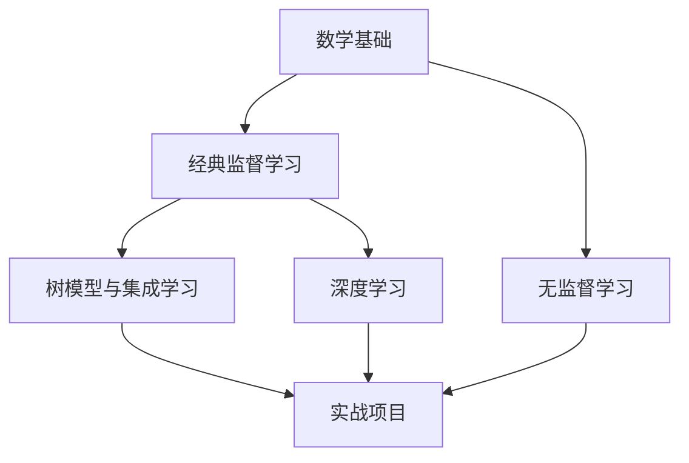

# 机器学习专题

从理论基础到算法实战，系统学习机器学习核心知识。

## 路线概览

## 文档目录

### 基础准备

- [数学基础回顾](./math-review) — 线性代数、概率论、微积分核心知识

### 经典监督学习

- [线性回归](./linear-regression) — 最小二乘法、梯度下降、正则化
- [逻辑回归](./logistic-regression) — 二分类、Sigmoid、决策边界
- [支持向量机](./svm) — 最大间隔、核函数、软间隔

### 树模型与集成学习

- [决策树](./decision-tree) — 信息增益、剪枝、CART
- [随机森林](./random-forest) — Bagging、特征随机、OOB 验证
- [XGBoost & LightGBM](./xgboost-lightgbm) — 梯度提升、正则化、工业级实现

### 无监督学习

- [K-Means 聚类](./kmeans-clustering) — 划分式聚类、肘部法则
- [DBSCAN](./dbscan) — 基于密度的聚类、噪声处理
- [PCA 降维](./pca) — 主成分分析、特征值分解

### 深度学习

- [神经网络基础](./neural-network-basics) — 感知机、反向传播、优化器
- [卷积神经网络](./cnn) — 卷积、池化、经典架构
- [RNN & Transformer](./rnn-transformer) — 序列建模、注意力机制

### 实战

- [实战项目](./ml-project) — 端到端机器学习项目

## 学习建议

1. **先过数学基础**，不需要全部记住，了解核心概念即可，遇到不懂的再回头查
2. **按顺序学习监督学习算法**，从线性回归开始，逐步深入
3. **每个算法都动手写代码**，文档中的代码示例建议亲自跑一遍
4. **用实战项目检验学习效果**，理论和手写代码之间还有工程落地这道坎
